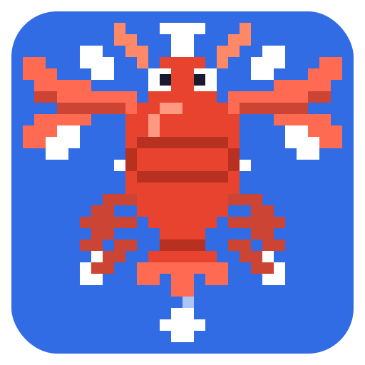
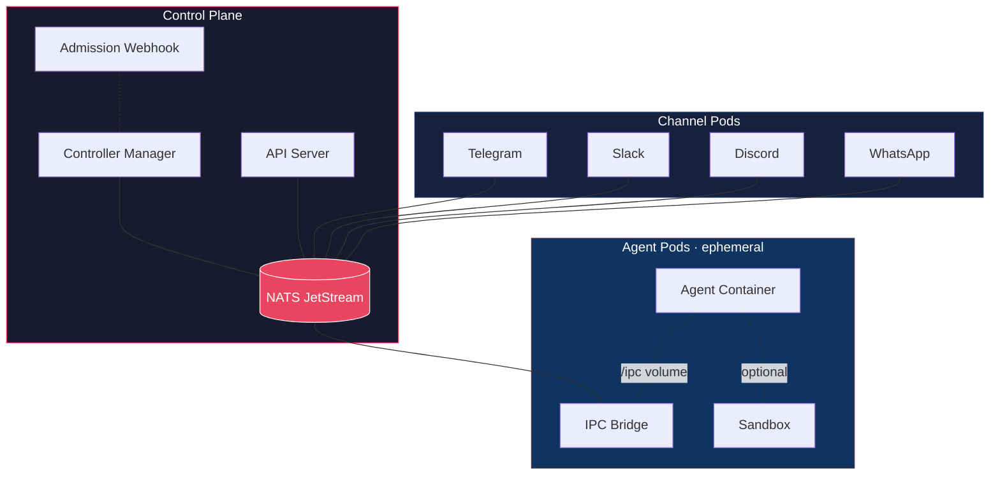

# K8sClaw

<p align="center">
  
</p>

<p align="center">
  <strong>Kubernetes-native AI Agent Management Platform</strong><br>
  <em>Decompose monolithic AI agent gateways into multi-tenant, horizontally scalable systems where every sub-agent runs as an ephemeral Kubernetes pod.</em>
</p>

<p align="center">
  <a href="https://github.com/AlexsJones/k8sclaw/actions"></a>
  <a href="https://github.com/AlexsJones/k8sclaw/releases/latest"></a>
  <a href="LICENSE"></a>
</p>

---

### Quick Install (macOS / Linux)

```bash
curl -fsSL https://deploy.k8sclaw.ai/install.sh | sh
```

### Deploy to Your Cluster

```bash
k8sclaw install          # CRDs, controllers, webhook, NATS, RBAC, network policies
k8sclaw uninstall        # clean removal
```

## Architecture



## Custom Resources

| CRD | Description |
|-----|-------------|
| `ClawInstance` | Per-user / per-tenant gateway configuration |
| `AgentRun` | Ephemeral agent execution (maps to a K8s Job) |
| `ClawPolicy` | Feature and tool gating policy |
| `SkillPack` | Portable skill bundles (generates ConfigMaps) |

## Project Structure

```
k8sclaw/
├── api/v1alpha1/           # CRD type definitions
├── cmd/                    # Binary entry points
│   ├── controller/         # Controller manager
│   ├── apiserver/          # HTTP + WebSocket API server
│   ├── ipc-bridge/         # IPC bridge sidecar
│   ├── webhook/            # Admission webhook
│   └── k8sclaw/            # CLI tool
├── internal/               # Internal packages
│   ├── controller/         # Kubernetes controllers
│   ├── orchestrator/       # Agent pod builder & spawner
│   ├── apiserver/          # API server handlers
│   ├── eventbus/           # NATS JetStream event bus
│   ├── ipc/                # IPC bridge (fsnotify + NATS)
│   ├── webhook/            # Policy enforcement webhooks
│   ├── session/            # Session persistence (PostgreSQL)
│   └── channel/            # Channel base types
├── channels/               # Channel pod implementations
├── images/                 # Dockerfiles
├── config/                 # Kubernetes manifests
│   ├── crd/bases/          # CRD YAML definitions
│   ├── manager/            # Controller + API server deployment
│   ├── rbac/               # ServiceAccount, ClusterRole, bindings
│   ├── webhook/            # Webhook deployment + configuration
│   ├── network/            # NetworkPolicy for agent isolation
│   ├── nats/               # NATS JetStream deployment
│   ├── cert/               # TLS certificate resources
│   └── samples/            # Example custom resources
├── migrations/             # PostgreSQL schema migrations
├── docs/                   # Design documentation
├── Makefile
└── README.md
```

## Prerequisites

- Kubernetes cluster (v1.28+)
- `kubectl` configured to your cluster

> NATS and cert-manager are installed automatically by `k8sclaw install`.

## Quick Start

```bash
# Install the CLI
curl -fsSL https://deploy.k8sclaw.ai/install.sh | sh

# Deploy to your cluster
k8sclaw install

# Or install a specific version
k8sclaw install --version v0.1.0

# Create a sample ClawInstance
kubectl apply -f https://raw.githubusercontent.com/AlexsJones/k8sclaw/main/config/samples/clawinstance_sample.yaml
```

### CLI Usage

```bash
k8sclaw instances list                              # list instances
k8sclaw runs list                                   # list agent runs
k8sclaw features enable browser-automation \
  --policy default-policy                           # enable a feature gate
k8sclaw features list --policy default-policy       # list feature gates
```

## Development

```bash
make test        # run tests
make lint        # run linter
make manifests   # generate CRD manifests
make run         # run controller locally (needs kubeconfig)
```

## Key Design Decisions

| Decision | Rationale |
|----------|-----------|
| **Ephemeral Agent Pods** | Each agent run creates a K8s Job — agent container + IPC bridge sidecar + optional sandbox |
| **Filesystem IPC** | Agent ↔ control plane via `/ipc` volume watched by the bridge sidecar — language-agnostic |
| **NATS JetStream** | Decoupled event bus with durable subscriptions |
| **NetworkPolicy isolation** | Agent pods get deny-all; only the IPC bridge connects to the bus |
| **Policy-as-CRD** | `ClawPolicy` resources gate tools, sandboxes, and feature flags via admission webhooks |

## Configuration

| Variable | Component | Description |
|----------|-----------|-------------|
| `EVENT_BUS_URL` | All | NATS server URL |
| `DATABASE_URL` | API Server | PostgreSQL connection string |
| `INSTANCE_NAME` | Channels | Owning ClawInstance name |
| `TELEGRAM_BOT_TOKEN` | Telegram | Bot API token |
| `SLACK_BOT_TOKEN` | Slack | Bot OAuth token |
| `DISCORD_BOT_TOKEN` | Discord | Bot token |
| `WHATSAPP_ACCESS_TOKEN` | WhatsApp | Cloud API access token |

## License

Apache License 2.0
