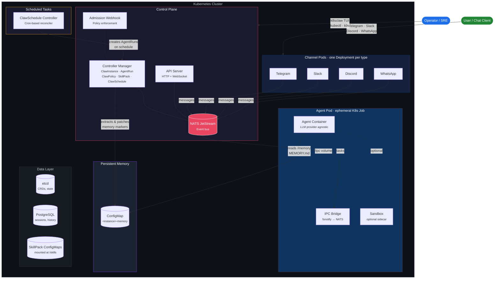

# K8sClaw

<p align="center">
  
</p>

<p align="center">
  <strong>The Kubernetes-Native Agentic Control Plane</strong><br>
  <em>What OpenClaw does in-process, K8sClaw does with Kubernetes primitives.<br>
  Every agent is an ephemeral Pod. Every policy is a CRD. Every execution is a Job.<br>
  Multi-tenant, horizontally scalable, and cloud-native from the ground up.</em><br><br>
  From the creator of <a href="https://github.com/k8sgpt-ai/k8sgpt">k8sgpt</a> and <a href="https://github.com/AlexsJones/llmfit">llmfit</a>
</p>

<p align="center">
  <a href="https://github.com/AlexsJones/k8sclaw/actions"></a>
  <a href="https://github.com/AlexsJones/k8sclaw/releases/latest"></a>
  <a href="LICENSE"></a>
</p>

---

## Why K8sClaw?

Agentic frameworks like OpenClaw pioneered rich agent orchestration — sub-agent registries, tool pipelines, channel integrations, and sandbox execution. But they run as **in-process monoliths** with file-based state, single-instance locks, and tightly coupled plugin systems.

K8sClaw takes the same agentic control model and rebuilds it on Kubernetes primitives:

| Concern | OpenClaw (in-process) | K8sClaw (Kubernetes-native) |
|---------|----------------------|----------------------------|
| **Agent execution** | Shared memory, single process | Ephemeral **Pod** per invocation (K8s Job) |
| **Orchestration** | In-process registry + lane queue | **CRD-based** registry with controller reconciliation |
| **Sandbox isolation** | Long-lived Docker sidecar | Pod **SecurityContext** + PodSecurity admission |
| **IPC** | In-process EventEmitter | Filesystem sidecar + **NATS JetStream** |
| **Tool/feature gating** | 7-layer in-process pipeline | **Admission webhooks** + `ClawPolicy` CRD |
| **Persistent memory** | Files on disk (`~/.openclaw/`) | **ConfigMap** per instance, controller-managed |
| **Scheduled tasks** | Cron jobs / external scripts | **ClawSchedule CRD** with cron controller |
| **State** | SQLite + flat files | **etcd** (CRDs) + PostgreSQL + object storage |
| **Multi-tenancy** | Single-instance file lock | **Namespaced CRDs**, RBAC, NetworkPolicy |
| **Scaling** | Vertical only | **Horizontal** — stateless control plane, HPA |
| **Channel connections** | In-process per channel | Dedicated **Deployment** per channel type |
| **Observability** | Application logs | `kubectl logs`, events, conditions, **k9s-style TUI** |

The result: every concept that OpenClaw manages in application code, K8sClaw expresses as a Kubernetes resource — declarative, reconcilable, observable, and scalable.

---

### Quick Install (macOS / Linux)

```bash
curl -fsSL https://deploy.k8sclaw.ai/install.sh | sh
```

### Deploy to Your Cluster

```bash
k8sclaw install          # CRDs, controllers, webhook, NATS, RBAC, network policies
k8sclaw onboard          # interactive setup wizard — instance, provider, channel
k8sclaw                  # launch the interactive TUI (default command)
k8sclaw uninstall        # clean removal
```

## Architecture



### How It Works

1. **A message arrives** via a channel pod (Telegram, Slack, etc.) and is published to the NATS event bus.
2. **The controller creates an AgentRun CR**, which reconciles into an ephemeral K8s Job — an agent container + IPC bridge sidecar + optional sandbox.
3. **The agent container** calls the configured LLM provider (OpenAI, Anthropic, Azure, Ollama, or any OpenAI-compatible endpoint), with skills mounted as files and persistent memory injected from a ConfigMap.
4. **Results flow back** through the IPC bridge → NATS → channel pod → user. The controller extracts structured results and memory updates from pod logs.
5. **Everything is a Kubernetes resource** — instances, runs, policies, skills, and schedules are all CRDs. Lifecycle is managed by controllers. Access is gated by admission webhooks. Network isolation is enforced by NetworkPolicy. The TUI gives you k9s-style visibility into the entire system.

## Custom Resources

K8sClaw models every agentic concept as a Kubernetes Custom Resource:

| CRD | Kubernetes Analogy | Purpose |
|-----|--------------------|---------|
| `ClawInstance` | Namespace / Tenant | Per-user gateway — channels, provider config, memory settings, skill bindings |
| `AgentRun` | Job | Single agent execution — task, model, result capture, memory extraction |
| `ClawPolicy` | NetworkPolicy | Feature and tool gating — what an agent can and cannot do |
| `SkillPack` | ConfigMap | Portable skill bundles — mounted into agent pods as files |
| `ClawSchedule` | CronJob | Recurring tasks — heartbeats, sweeps, scheduled runs with cron expressions |

### Persistent Memory

Each `ClawInstance` can enable **persistent memory** — a ConfigMap (`<instance>-memory`) containing `MEMORY.md` that is:
- Mounted read-only into every agent pod at `/memory/MEMORY.md`
- Prepended as context so the agent knows what it has learned
- Updated after each run — the controller extracts memory markers from pod logs and patches the ConfigMap

This gives agents **continuity across runs** without external databases or file systems. Memory lives in etcd alongside all other cluster state.

### Scheduled Tasks (Heartbeats)

`ClawSchedule` resources define cron-based recurring agent runs — the Kubernetes-native equivalent of OpenClaw's heartbeat system:

```yaml
apiVersion: k8sclaw.io/v1alpha1
kind: ClawSchedule
metadata:
  name: daily-standup
spec:
  instanceRef: alice
  schedule: "0 9 * * *"        # every day at 9am
  type: heartbeat
  task: "Review overnight alerts and summarize status"
  includeMemory: true           # inject persistent memory
  concurrencyPolicy: Forbid     # skip if previous run still active
```

Concurrency policies (`Forbid`, `Allow`, `Replace`) work like `CronJob.spec.concurrencyPolicy` — a natural extension of Kubernetes semantics.

## Interactive TUI

Running `k8sclaw` with no arguments launches a **k9s-style interactive terminal UI** for full cluster-wide agentic management.

### Views

| Key | View | Description |
|-----|------|-------------|
| `1` | Instances | ClawInstance list with status, channels, memory config |
| `2` | Runs | AgentRun list with phase, duration, result preview |
| `3` | Policies | ClawPolicy list with feature gates |
| `4` | Skills | SkillPack list with file counts |
| `5` | Channels | Channel pod status (Telegram, Slack, Discord, WhatsApp) |
| `6` | Pods | All k8sclaw pods with status and restarts |
| `7` | Schedules | ClawSchedule list with cron, type, phase, run count |

### Keybindings

| Key | Action |
|-----|--------|
| `l` | View logs for the selected resource |
| `d` | Describe the selected resource (kubectl describe) |
| `x` | Delete the selected resource (with confirmation) |
| `Enter` | View details / select row |
| `Tab` | Cycle between views |
| `Esc` | Go back / close panel |
| `?` | Toggle help |

### Slash Commands

| Command | Description |
|---------|-------------|
| `/run <task>` | Create and submit an AgentRun |
| `/schedule <instance> <cron> <task>` | Create a ClawSchedule |
| `/memory <instance>` | View persistent memory for an instance |
| `/instances` `/runs` `/channels` `/schedules` | Switch views |
| `/delete <type> <name>` | Delete a resource with confirmation |

## Getting Started

### 1. Install the CLI

```bash
curl -fsSL https://deploy.k8sclaw.ai/install.sh | sh
```

Detects your OS and architecture, downloads the latest release binary, and installs to `/usr/local/bin` (or `~/.local/bin`).

### 2. Deploy to your cluster

```bash
k8sclaw install
```

Applies CRDs, RBAC, controller manager, API server, admission webhook, NATS event bus, cert-manager (if not present), and network policies to your current kubectl context.

```bash
k8sclaw install --version v0.0.13   # specific version
```

### 3. Onboard — interactive setup wizard

```bash
k8sclaw onboard
```

The wizard walks you through five steps:

```
  ╔═══════════════════════════════════════════╗
  ║         K8sClaw · Onboarding Wizard       ║
  ╚═══════════════════════════════════════════╝

  Step 1/5 — Cluster check
  Step 2/5 — Name your ClawInstance
  Step 3/5 — Choose your AI provider
  Step 4/5 — Connect a channel (optional)
  Step 5/5 — Apply default policy
```

**Step 3** supports any GenAI provider:

| Provider | Base URL | API Key |
|----------|----------|---------|
| OpenAI | (default) | `OPENAI_API_KEY` |
| Anthropic | (default) | `ANTHROPIC_API_KEY` |
| Azure OpenAI | your endpoint | `AZURE_OPENAI_API_KEY` |
| Ollama | `http://ollama:11434/v1` | none |
| Any OpenAI-compatible | custom URL | custom |

### 4. Launch K8sClaw

```bash
k8sclaw
```

The interactive TUI gives you full visibility — browse instances, runs, schedules, and channels; view logs and describe output inline; submit agent runs with `/run <task>`; check memory with `/memory <instance>`.

```bash
k8sclaw instances list                              # list instances
k8sclaw runs list                                   # list agent runs
k8sclaw features enable browser-automation \
  --policy default-policy                           # enable a feature gate
```

### 5. Remove K8sClaw

```bash
k8sclaw uninstall
```

## Project Structure

```
k8sclaw/
├── api/v1alpha1/           # CRD type definitions (ClawInstance, AgentRun, ClawPolicy, SkillPack, ClawSchedule)
├── cmd/                    # Binary entry points
│   ├── agent-runner/       # LLM agent runner (runs inside agent pods)
│   ├── controller/         # Controller manager (reconciles all CRDs)
│   ├── apiserver/          # HTTP + WebSocket API server
│   ├── ipc-bridge/         # IPC bridge sidecar (fsnotify → NATS)
│   ├── webhook/            # Admission webhook (policy enforcement)
│   └── k8sclaw/            # CLI + interactive TUI
├── internal/               # Internal packages
│   ├── controller/         # Kubernetes controllers (5 reconcilers)
│   ├── orchestrator/       # Agent pod builder & spawner
│   ├── apiserver/          # API server handlers
│   ├── eventbus/           # NATS JetStream event bus
│   ├── ipc/                # IPC bridge (fsnotify + NATS)
│   ├── webhook/            # Policy enforcement webhooks
│   ├── session/            # Session persistence (PostgreSQL)
│   └── channel/            # Channel base types
├── channels/               # Channel pod implementations (Telegram, Slack, Discord, WhatsApp)
├── images/                 # Dockerfiles for all components
├── config/                 # Kubernetes manifests
│   ├── crd/bases/          # CRD YAML definitions
│   ├── manager/            # Controller deployment
│   ├── rbac/               # ClusterRole, bindings
│   ├── webhook/            # Webhook configuration
│   ├── network/            # NetworkPolicy for agent isolation
│   ├── nats/               # NATS JetStream deployment
│   ├── cert/               # TLS certificate resources
│   └── samples/            # Example CRs
├── migrations/             # PostgreSQL schema migrations
├── docs/                   # Design documentation
├── Makefile
└── README.md
```

## Key Design Decisions

| Decision | Kubernetes Primitive | Rationale |
|----------|---------------------|-----------|
| **One Pod per agent run** | Job | Blast-radius isolation, resource limits, automatic cleanup — each agent is as ephemeral as a CronJob pod |
| **Filesystem IPC** | emptyDir volume | Agent writes to `/ipc/`, bridge sidecar watches via fsnotify and publishes to NATS — language-agnostic, zero dependencies in agent container |
| **NATS JetStream** | StatefulSet | Durable pub/sub with replay — channels and control plane communicate without direct coupling |
| **NetworkPolicy isolation** | NetworkPolicy | Agent pods get deny-all egress; only the IPC bridge connects to the event bus — agents cannot reach the internet or other pods |
| **Policy-as-CRD** | Admission Webhook | `ClawPolicy` resources gate tools, sandboxes, and features — enforced at admission time, not at runtime |
| **Memory-as-ConfigMap** | ConfigMap | Persistent agent memory lives in etcd — no external database, no file system, fully declarative and backed up with cluster state |
| **Schedule-as-CRD** | CronJob analogy | `ClawSchedule` resources define recurring tasks with cron expressions — the controller creates AgentRuns, not the user |
| **Skills-as-ConfigMap** | ConfigMap volume | SkillPacks generate ConfigMaps mounted into agent pods — portable, versionable, namespace-scoped |

## Configuration

| Variable | Component | Description |
|----------|-----------|-------------|
| `EVENT_BUS_URL` | All | NATS server URL |
| `DATABASE_URL` | API Server | PostgreSQL connection string |
| `INSTANCE_NAME` | Channels | Owning ClawInstance name |
| `MEMORY_ENABLED` | Agent Runner | Whether persistent memory is active |
| `TELEGRAM_BOT_TOKEN` | Telegram | Bot API token |
| `SLACK_BOT_TOKEN` | Slack | Bot OAuth token |
| `DISCORD_BOT_TOKEN` | Discord | Bot token |
| `WHATSAPP_ACCESS_TOKEN` | WhatsApp | Cloud API access token |

## Development

```bash
make test        # run tests (42 passing)
make lint        # run linter
make manifests   # generate CRD manifests
make run         # run controller locally (needs kubeconfig)
```

## License

Apache License 2.0
