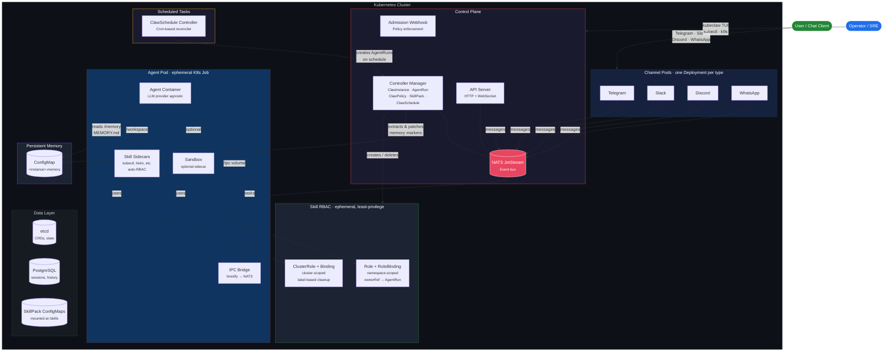

# KubeClaw

<p align="center">
  
</p>

<p align="center">
  <strong>The Kubernetes-Native Agentic Control Plane</strong><br>
  <em>Run a fleet of AI agents on Kubernetes. Administer your cluster agentically.<br>
  Every agent is an ephemeral Pod. Every policy is a CRD. Every execution is a Job.<br>
  Orchestrate multi-agent workflows <b>and</b> let agents diagnose, scale, and remediate your infrastructure.<br>
  Multi-tenant. Horizontally scalable. Safe by design.</em><br><br>
  From the creator of <a href="https://github.com/k8sgpt-ai/k8sgpt">k8sgpt</a> and <a href="https://github.com/AlexsJones/llmfit">llmfit</a>
</p>

<p align="center">
  <a href="https://github.com/AlexsJones/kubeclaw/actions"></a>
  <a href="https://github.com/AlexsJones/kubeclaw/releases/latest"></a>
  <a href="LICENSE"></a>
</p>

---
### Quick Install (macOS / Linux)

```bash
curl -fsSL https://deploy.k8sclaw.ai/install.sh | sh
```

## Why KubeClaw?

KubeClaw serves **two powerful use cases** on one Kubernetes-native platform:

1. **Orchestrate fleets of AI agents** — customer support, code review, data pipelines, or any domain-specific workflow. Each agent gets its own pod, RBAC, and network policy with proper tenant isolation.
2. **Administer the cluster itself agentically** — point agents inward to diagnose failures, scale deployments, triage alerts, and remediate issues, all with Kubernetes-native isolation, RBAC, and audit trails.

Agentic frameworks like OpenClaw pioneered rich agent orchestration — sub-agent registries, tool pipelines, channel integrations, and sandbox execution. But they run as **in-process monoliths** with file-based state, single-instance locks, and tightly coupled plugin systems.

KubeClaw takes the same agentic control model and rebuilds it on Kubernetes primitives:

### Isolated Skill Sidecars — a game-changer

Most agent frameworks dump every tool into one shared process. One bad `kubectl delete` and your whole agent environment is toast. KubeClaw does this completely differently:

**Every skill runs in its own sidecar container** — a separate, isolated process injected into the agent pod at runtime. Use skills to give agents cluster-admin capabilities (`kubectl`, `helm`, scaling) or domain-specific tools — each with ephemeral least-privilege RBAC that's garbage-collected when the run finishes. Toggle a skill on, and the controller automatically:

- Injects a dedicated sidecar container with only the binaries that skill needs (`kubectl`, `helm`, `terraform`, etc.)
- Provisions **ephemeral, least-privilege RBAC** scoped to that single agent run — no standing permissions, no god-roles
- Shares a `/workspace` volume so the agent can coordinate with the sidecar
- **Garbage-collects everything** when the run finishes — containers, roles, bindings, all gone

This means you can give an agent full `kubectl` access for a troubleshooting run without worrying about leftover permissions. Skills are declared as CRDs, toggled per-instance in the TUI with a single keypress, and their containers are built and shipped alongside the rest of KubeClaw. No plugins to install, no runtime to configure — just Kubernetes-native isolation that scales.

> _"Give the agent tools, not trust."_ — Whether it's orchestrating a fleet or administering the cluster, skills get exactly the permissions they declare, for exactly as long as the run lasts, and not a second longer.

### How it compares

| Concern | OpenClaw (in-process) | KubeClaw (Kubernetes-native) |
|---------|----------------------|----------------------------|
| **Agent execution** | Shared memory, single process | Ephemeral **Pod** per invocation (K8s Job) |
| **Orchestration** | In-process registry + lane queue | **CRD-based** registry with controller reconciliation |
| **Sandbox isolation** | Long-lived Docker sidecar | Pod **SecurityContext** + PodSecurity admission |
| **IPC** | In-process EventEmitter | Filesystem sidecar + **NATS JetStream** |
| **Tool/feature gating** | 7-layer in-process pipeline | **Admission webhooks** + `ClawPolicy` CRD |
| **Persistent memory** | Files on disk (`~/.openclaw/`) | **ConfigMap** per instance, controller-managed |
| **Scheduled tasks** | Cron jobs / external scripts | **ClawSchedule CRD** with cron controller |
| **State** | SQLite + flat files | **etcd** (CRDs) + PostgreSQL + object storage |
| **Multi-tenancy** | Single-instance file lock | **Namespaced CRDs**, RBAC, NetworkPolicy |
| **Scaling** | Vertical only | **Horizontal** — stateless control plane, HPA |
| **Channel connections** | In-process per channel | Dedicated **Deployment** per channel type |
| **Observability** | Application logs | `kubectl logs`, events, conditions, **k9s-style TUI** |

The result: every concept that OpenClaw manages in application code, KubeClaw expresses as a Kubernetes resource — then adds the ability to point agents at the cluster itself. Declarative, reconcilable, observable, and scalable.

---

### Deploy to Your Cluster

```bash
kubeclaw install          # CRDs, controllers, webhook, NATS, RBAC, network policies
kubeclaw onboard          # interactive setup wizard — instance, provider, channel
kubeclaw                  # launch the interactive TUI (default command)
kubeclaw uninstall        # clean removal
```

## Architecture



### How It Works

1. **A message arrives** via a channel pod (Telegram, Slack, etc.) and is published to the NATS event bus.
2. **The controller creates an AgentRun CR**, which reconciles into an ephemeral K8s Job — an agent container + IPC bridge sidecar + optional sandbox + skill sidecars (with auto-provisioned RBAC).
3. **The agent container** calls the configured LLM provider (OpenAI, Anthropic, Azure, Ollama, or any OpenAI-compatible endpoint), with skills mounted as files, persistent memory injected from a ConfigMap, and tool sidecars providing runtime capabilities like `kubectl`.
4. **Results flow back** through the IPC bridge → NATS → channel pod → user. The controller extracts structured results and memory updates from pod logs.
5. **Everything is a Kubernetes resource** — instances, runs, policies, skills, and schedules are all CRDs. Lifecycle is managed by controllers. Access is gated by admission webhooks. Network isolation is enforced by NetworkPolicy. The TUI gives you k9s-style visibility into the entire system.

## Custom Resources

KubeClaw models every agentic concept as a Kubernetes Custom Resource:

| CRD | Kubernetes Analogy | Purpose |
|-----|--------------------|---------|
| `ClawInstance` | Namespace / Tenant | Per-user gateway — channels, provider config, memory settings, skill bindings |
| `AgentRun` | Job | Single agent execution — task, model, result capture, memory extraction |
| `ClawPolicy` | NetworkPolicy | Feature and tool gating — what an agent can and cannot do |
| `SkillPack` | ConfigMap | Portable skill bundles — kubectl, Helm, or custom tools — mounted into agent pods as files, with optional sidecar containers for cluster ops |
| `ClawSchedule` | CronJob | Recurring tasks — heartbeats, sweeps, scheduled runs with cron expressions |

### Skill Sidecars

SkillPacks can declare a **sidecar container** that is dynamically injected into the agent pod when the skill is active. The controller automatically creates scoped RBAC:

```
ClawInstance has skills: [k8s-ops]
  → AgentRun created
    → Controller resolves SkillPack "k8s-ops"
      → Finds sidecar: { image: skill-k8s-ops, rbac: [...] }
      → Injects sidecar container into pod
      → Creates Role + RoleBinding (namespace-scoped)
      → Creates ClusterRole + ClusterRoleBinding (cluster-wide access)
    → Pod runs with kubectl + RBAC available
    → On completion/deletion: all skill RBAC cleaned up
```

The `k8s-ops` built-in skill is the first proof of concept — it provides a sidecar with `kubectl`, `curl`, and `jq` with full admin access to workload resources (pods, deployments, services, etc.) and cluster-wide read access to nodes, namespaces, and more. See the **[Skill Authoring Guide](docs/writing-skills.md)** for a full walkthrough of building your own skills. To enable a skill, toggle it on your instance:

```
# In the TUI: press 's' on an instance → Space to toggle k8s-ops
# Or via kubectl:
kubectl patch clawinstance <name> --type=merge -p '{"spec":{"skills":[{"skillPackRef":"k8s-ops"}]}}'
```

### Security

KubeClaw enforces defence-in-depth at every layer — from network isolation to per-run RBAC:

| Layer | Mechanism | Scope |
|-------|-----------|-------|
| **Network** | `NetworkPolicy` deny-all egress on agent pods | Only the IPC bridge can reach NATS; agents cannot reach the internet or other pods |
| **Pod sandbox** | `SecurityContext` — `runAsNonRoot`, UID 1000, read-only root filesystem | Every agent and sidecar container runs with least privilege |
| **Admission control** | `ClawPolicy` admission webhook | Feature and tool gates enforced before the pod is created |
| **Skill RBAC** | Ephemeral `Role`/`ClusterRole` per AgentRun | Each skill declares exactly the API permissions it needs — the controller auto-provisions them at run start and revokes them on completion |
| **RBAC lifecycle** | `ownerReference` (namespace) + label-based cleanup (cluster) | Namespace RBAC is garbage-collected by Kubernetes. Cluster RBAC is cleaned up by the controller on AgentRun completion and deletion. |
| **Controller privilege** | `cluster-admin` binding | The controller needs `cluster-admin` to create arbitrary RBAC rules declared by SkillPacks (Kubernetes prevents RBAC escalation otherwise) |
| **Multi-tenancy** | Namespaced CRDs + Kubernetes RBAC | Instances, runs, and policies are namespace-scoped; standard K8s RBAC controls who can create them |

The skill sidecar RBAC model deserves special attention: permissions are **created on-demand** when an AgentRun starts, scoped to exactly the APIs the skill needs, and **deleted when the run finishes**. There is no standing god-role — each run gets its own short-lived credentials. This is the Kubernetes-native equivalent of temporary IAM session credentials.

### Persistent Memory

Each `ClawInstance` can enable **persistent memory** — a ConfigMap (`<instance>-memory`) containing `MEMORY.md` that is:
- Mounted read-only into every agent pod at `/memory/MEMORY.md`
- Prepended as context so the agent knows what it has learned
- Updated after each run — the controller extracts memory markers from pod logs and patches the ConfigMap

This gives agents **continuity across runs** without external databases or file systems. Memory lives in etcd alongside all other cluster state.

### Scheduled Tasks (Heartbeats)

`ClawSchedule` resources define cron-based recurring agent runs — perfect for automated cluster health checks, overnight alert reviews, resource right-sizing sweeps, or any domain-specific task:

```yaml
apiVersion: kubeclaw.io/v1alpha1
kind: ClawSchedule
metadata:
  name: daily-standup
spec:
  instanceRef: alice
  schedule: "0 9 * * *"        # every day at 9am
  type: heartbeat
  task: "Review overnight alerts and summarize status"
  includeMemory: true           # inject persistent memory
  concurrencyPolicy: Forbid     # skip if previous run still active
```

Concurrency policies (`Forbid`, `Allow`, `Replace`) work like `CronJob.spec.concurrencyPolicy` — a natural extension of Kubernetes semantics.

## Interactive TUI

Running `kubeclaw` with no arguments launches a **k9s-style interactive terminal UI** for full cluster-wide agentic management.

### Views

| Key | View | Description |
|-----|------|-------------|
| `1` | Instances | ClawInstance list with status, channels, memory config |
| `2` | Runs | AgentRun list with phase, duration, result preview |
| `3` | Policies | ClawPolicy list with feature gates |
| `4` | Skills | SkillPack list with file counts |
| `5` | Channels | Channel pod status (Telegram, Slack, Discord, WhatsApp) |
| `6` | Pods | All kubeclaw pods with status and restarts |
| `7` | Schedules | ClawSchedule list with cron, type, phase, run count |

### Keybindings

| Key | Action |
|-----|--------|
| `l` | View logs for the selected resource |
| `d` | Describe the selected resource (kubectl describe) |
| `x` | Delete the selected resource (with confirmation) |
| `Enter` | View details / select row |
| `Tab` | Cycle between views |
| `Esc` | Go back / close panel |
| `?` | Toggle help |

### Slash Commands

| Command | Description |
|---------|-------------|
| `/run <task>` | Create and submit an AgentRun |
| `/schedule <instance> <cron> <task>` | Create a ClawSchedule |
| `/memory <instance>` | View persistent memory for an instance |
| `/instances` `/runs` `/channels` `/schedules` | Switch views |
| `/delete <type> <name>` | Delete a resource with confirmation |

## Getting Started

### 1. Install the CLI

```bash
curl -fsSL https://deploy.k8sclaw.ai/install.sh | sh
```

Detects your OS and architecture, downloads the latest release binary, and installs to `/usr/local/bin` (or `~/.local/bin`).

### 2. Deploy to your cluster

```bash
kubeclaw install
```

Applies CRDs, RBAC, controller manager, API server, admission webhook, NATS event bus, cert-manager (if not present), and network policies to your current kubectl context.

```bash
kubeclaw install --version v0.0.13   # specific version
```

### 3. Onboard — interactive setup wizard

```bash
kubeclaw onboard
```

The wizard walks you through five steps:

```
  ╔═══════════════════════════════════════════╗
  ║         KubeClaw · Onboarding Wizard       ║
  ╚═══════════════════════════════════════════╝

  Step 1/5 — Cluster check
  Step 2/5 — Name your ClawInstance
  Step 3/5 — Choose your AI provider
  Step 4/5 — Connect a channel (optional)
  Step 5/5 — Apply default policy
```

**Step 3** supports any GenAI provider:

| Provider | Base URL | API Key |
|----------|----------|---------|
| OpenAI | (default) | `OPENAI_API_KEY` |
| Anthropic | (default) | `ANTHROPIC_API_KEY` |
| Azure OpenAI | your endpoint | `AZURE_OPENAI_API_KEY` |
| Ollama | `http://ollama:11434/v1` | none |
| Any OpenAI-compatible | custom URL | custom |

### 4. Launch KubeClaw

```bash
kubeclaw
```

The interactive TUI gives you full visibility — browse instances, runs, schedules, and channels; view logs and describe output inline; submit agent runs with `/run <task>`; check memory with `/memory <instance>`.

```bash
kubeclaw instances list                              # list instances
kubeclaw runs list                                   # list agent runs
kubeclaw features enable browser-automation \
  --policy default-policy                           # enable a feature gate
```

### 5. Remove KubeClaw

```bash
kubeclaw uninstall
```

## Project Structure

```
kubeclaw/
├── api/v1alpha1/           # CRD type definitions (ClawInstance, AgentRun, ClawPolicy, SkillPack, ClawSchedule)
├── cmd/                    # Binary entry points
│   ├── agent-runner/       # LLM agent runner (runs inside agent pods)
│   ├── controller/         # Controller manager (reconciles all CRDs)
│   ├── apiserver/          # HTTP + WebSocket API server
│   ├── ipc-bridge/         # IPC bridge sidecar (fsnotify → NATS)
│   ├── webhook/            # Admission webhook (policy enforcement)
│   └── kubeclaw/            # CLI + interactive TUI
├── internal/               # Internal packages
│   ├── controller/         # Kubernetes controllers (5 reconcilers)
│   ├── orchestrator/       # Agent pod builder & spawner
│   ├── apiserver/          # API server handlers
│   ├── eventbus/           # NATS JetStream event bus
│   ├── ipc/                # IPC bridge (fsnotify + NATS)
│   ├── webhook/            # Policy enforcement webhooks
│   ├── session/            # Session persistence (PostgreSQL)
│   └── channel/            # Channel base types
├── channels/               # Channel pod implementations (Telegram, Slack, Discord, WhatsApp)
├── images/                 # Dockerfiles for all components
├── config/                 # Kubernetes manifests
│   ├── crd/bases/          # CRD YAML definitions
│   ├── manager/            # Controller deployment
│   ├── rbac/               # ClusterRole, bindings
│   ├── webhook/            # Webhook configuration
│   ├── network/            # NetworkPolicy for agent isolation
│   ├── nats/               # NATS JetStream deployment
│   ├── cert/               # TLS certificate resources
│   └── samples/            # Example CRs
├── migrations/             # PostgreSQL schema migrations
├── docs/                   # Design documentation
├── Makefile
└── README.md
```

## Key Design Decisions

| Decision | Kubernetes Primitive | Rationale |
|----------|---------------------|-----------|
| **One Pod per agent run** | Job | Blast-radius isolation, resource limits, automatic cleanup — each agent is as ephemeral as a CronJob pod |
| **Filesystem IPC** | emptyDir volume | Agent writes to `/ipc/`, bridge sidecar watches via fsnotify and publishes to NATS — language-agnostic, zero dependencies in agent container |
| **NATS JetStream** | StatefulSet | Durable pub/sub with replay — channels and control plane communicate without direct coupling |
| **NetworkPolicy isolation** | NetworkPolicy | Agent pods get deny-all egress; only the IPC bridge connects to the event bus — agents cannot reach the internet or other pods |
| **Policy-as-CRD** | Admission Webhook | `ClawPolicy` resources gate tools, sandboxes, and features — enforced at admission time, not at runtime |
| **Memory-as-ConfigMap** | ConfigMap | Persistent agent memory lives in etcd — no external database, no file system, fully declarative and backed up with cluster state |
| **Schedule-as-CRD** | CronJob analogy | `ClawSchedule` resources define recurring tasks with cron expressions — the controller creates AgentRuns, not the user |
| **Skills-as-ConfigMap** | ConfigMap volume | SkillPacks generate ConfigMaps mounted into agent pods — portable, versionable, namespace-scoped |
| **Skill sidecars with auto-RBAC** | Role / ClusterRole | SkillPacks can declare sidecar containers with RBAC rules — the controller injects the container and provisions ephemeral, least-privilege RBAC per run |

## Configuration

| Variable | Component | Description |
|----------|-----------|-------------|
| `EVENT_BUS_URL` | All | NATS server URL |
| `DATABASE_URL` | API Server | PostgreSQL connection string |
| `INSTANCE_NAME` | Channels | Owning ClawInstance name |
| `MEMORY_ENABLED` | Agent Runner | Whether persistent memory is active |
| `TELEGRAM_BOT_TOKEN` | Telegram | Bot API token |
| `SLACK_BOT_TOKEN` | Slack | Bot OAuth token |
| `DISCORD_BOT_TOKEN` | Discord | Bot token |
| `WHATSAPP_ACCESS_TOKEN` | WhatsApp | Cloud API access token |

## Development

```bash
make test        # run tests (46 passing)
make lint        # run linter
make manifests   # generate CRD manifests
make run         # run controller locally (needs kubeconfig)
```

## License

Apache License 2.0
